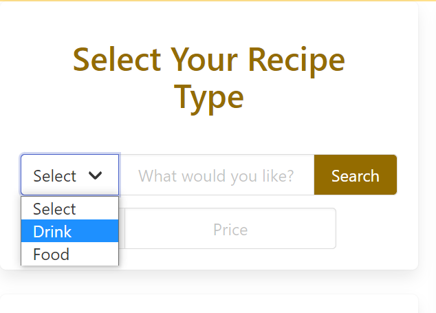
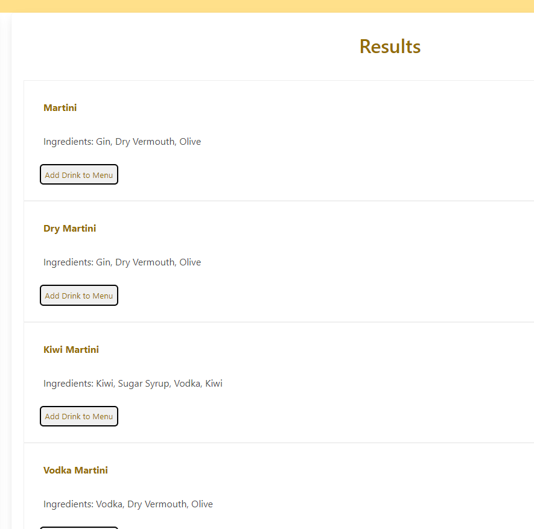
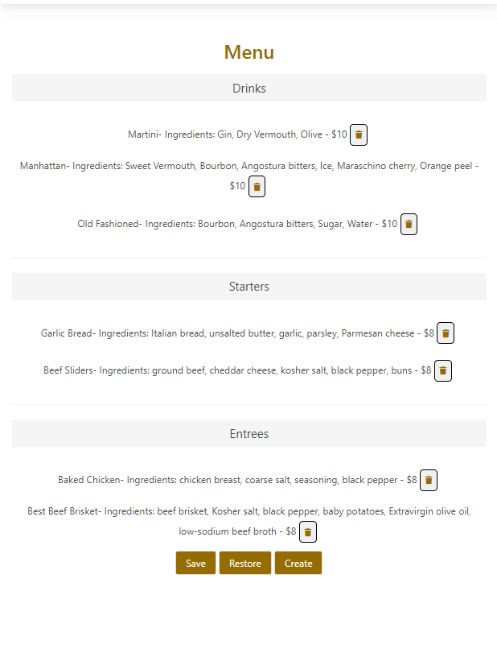

# Menu Maker

## Description

There are so many recipes and so little time. The options available in our modern age is staggering and when providing food service to customers, you need a menu. From restaurants to caterers, regular hosts to one-off events, the application is intended to provide ease for entrepeneurs to generate a menu of their choosing for their next event. 

The application reduces the time needed to plan your options so you can quit planning and start doing. As lovers of food, libations, and the party that accompanies them, we felt the need to create something to help the people that serve. Anyone who has worked in food knows the chaos that reigns throughout the process. Our hope is that we can cut out some of that chaotic energy, take a few tasks in your process and reduce them to a simple and easy-to-use tool. Chefs and Mixologists alike will appreciate a quick glance at what is being served and be able to take stock of what they have and need so that their event can go off without a hitch. 

This easily produced menu provides not only a wide assortment of potential food and drinks but also include ingredients so that picky-eaters and food connosiers can glance at what is being served and make a well informed decision for whatever their pallettes desire. 

This was our first attempt at integrating seperate APIs into one cohesive application. It was tough finding public APIs that had enough data worthy of generating a detailed source of information that could then be generated. We learned how to use both of these APIs and the result was something impressive. The idea as to how to use these APIs came with ease. While working through the development process, we learned how to seperate search criteria between these APIs, join them into one source of results and subsequent list items, turn the menu into a printable PDF, and store the menu locally so that the menu will save even after reloading.

## Table of Contents

- [Frameworks](#frameworks)
- [Installation](#installation)
- [API-Reference](#api-reference)
- [Usage](#usage)
- [Credits](#credits)
- [License](#license)

## Frameworks

As an alternative to using Bootstrap, this application was built with Bulma. Bulma is an open-source, simple collection of CSS classes, that allows users to take what they need to style their applications and leave the rest behind. Bulma is a mobile-first framework, prioritizing the use of mobile devices that dominates the climate of users today, allowing our application to be used from the leisure of home to on-the-go. 

## Installation

Use the link below to access the webpage containing our application. The app is easy-to-use and saves locally so that breaks from generating your menu is saved from potential interruption. 

## API Reference

https://www.thecocktaildb.com/api.php
https://developer.edamam.com/food-database-api-docs

## Usage

The application is a search tool of both a food and drink API. 

When either food or drink search criteria is entered, a list of potential options is listed. 

From there, the user can pick which items they would like to add to their menu which will automatically sort them into Drinks, Entrees, or Starters on the generated menu. The user is able to provide price

## Credits

Andrew Knoedler - https://github.com/aknoedler

Jack Gibbs - https://github.com/1-those-jacks

Jennifer Arboleda - https://github.com/internetjen

Kendall Coleman - https://github.com/k3ndall02

## License

N/A
